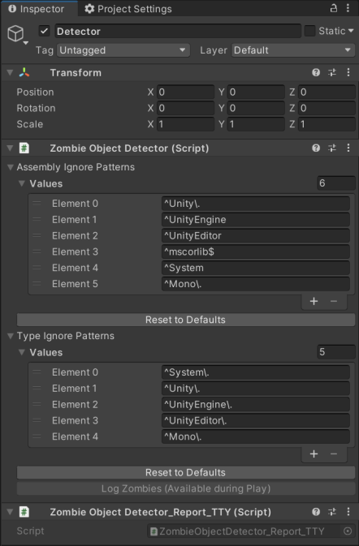

# Zombie Object Detector

Scripts to detect and diagnose zombie objects.

## Quick Start

### Package import

In the Unity Package Manager window, select `Add package from git URL` and add the URL as shown in the green Code button in GitHub.  For example `https://github.com/Unity-Technologies/ZombieObjectDetector.git`.

### Scene Configuration

In a scene where you would like to run zombie object detection, place a GameObject with two components; a `ZombieObjectDetector` and a `ZombieObjectDetector_Report_TTY`.  The two components must be on the same GameObject.



### Detection

To run detection in play mode in the editor, simply click `Log Zombies` in the Inspector window.

To run detection in a standalone build, call the method `RunZombieObjectDetection` on the ZombieObjectDetector component.  The output will appear in the TTY (wherever `Debug.Log` goes on your target platform).

#### Memory

The detection process uses a great deal of managed memory.  If your target platform has any sort of developer option to enable extra memory for development, then you should enable it.

#### Avoiding tests that cause reproduceable crashes

On some platforms (particularly consoles), detection has sometimes crashed reproducably when it tests objects of a particular type.  To avoid this, add whatever types are causing problems to the inspector field `Do not recurse into these Types during search`.  The values are all C# regular expressions.  See [here](https://docs.microsoft.com/en-us/dotnet/standard/base-types/regular-expression-language-quick-reference) for reference.  After adding a regular expression to the list you can type any string into the `Test` field, and it will tell you whether that string matches any of the regular expressions above it.

To discover exactly which type(s) are causing the crash in the first place, check the `Report Test` checkbox on the `ZombieObjectDetector_Report_TTY`.  This will print a `Debug.Log` line before _every single object_ that is tested.  This is incredibly verbose and slow, but it will show you exactly which object (and type) caused the crash.

# Background

Many of the user-facing C# classes in Unity act as lightweight handles to data that is actually held internally in native code.  The most obvious example is `UnityEngine.GameObject`.  Because C# GameObject instances **are C# objects**, they are subject to the usual garbage collection rules of the C# language; they will stay alive until they are no longer referenced by anything else, and then some time after that they will be collected by the garbage collector.

However the _actual data_ for these objects is held in natively-allocated memory by the native player executable, and the lifespan of this data and memory is entirely deterministic.  The memory holding the data for a GameObject will be deleted when the GameObject is `Destroy()`-ed manually or when the scene is exited.

This means that there is an opportunity for a C# object to outlive its native counterpart.  The C# instance can be "kept alive" by virtue of being referenced by another C# object, even after the native-side object has been destroyed.

For example a developer might keep a `List<GameObject>` of GameObjects that are interesting to them in some way, such as the enemies in a shoot-em-up.  Suppose the developer has a line of code passes the enemy GameObject in to `GameObject.Destroy` when its health reaches zero.  At that point, if the developer fails also to remove it from their `List<GameObject>`, then the C# instance will remain referenced and alive **even after its native counterpart has been destroyed**.

The class GameObject has a unique special trick which can make this situation even more difficult to diagnose.  A C# GameObject can detect if its native counterpart is no longer alive, and when it is in this special case it will return `true` if it is compared with null.

Therefore in the code:
```
GameObject obj = ...
if (obj != null) {
```
... the GameObject `obj` will know if its native counterpart has been destroyed, and will _not_ enter the `if` statement in that case.

There is a good discussion of this situation in this blog post from 2014.  As of 2022 nothing has changed in this regard. https://blogs.unity3d.com/2014/05/16/custom-operator-should-we-keep-it/.  Specifically the paragraph labelled "purpose two":

>When you get a c# object of type "GameObject", it contains almost nothing. this is because Unity is a C/C++ engine. All the actual information about this GameObject (its name, the list of components it has, its HideFlags, etc) lives in the c++ side. The only thing that the c# object has is a pointer to the native object. We call these c# objects "wrapper objects". The lifetime of these c++ objects like GameObject and everything else that derives from UnityEngine.Object is explicitly managed. These objects get destroyed when you load a new scene. Or when you call Object.Destroy(myObject); on them. Lifetime of c# objects gets managed the c# way, with a garbage collector. This means that it's possible to have a c# wrapper object that still exists, that wraps a c++ object that has already been destroyed. If you compare this object to null, our custom == operator will return "true" in this case, even though the actual c# variable is in reality not really null.


# Interpreting the output

## Output format
For any zombie object encountered, the message in the TTY will be of the form:
```
Found zombie of type {t}, at {path}
```

... where _t_ is the type of the zombie object, and _path_ is the period-separated route taken from one class' static field to that object.  This is one of _possibly-many_ references keeping that object alive.  Once an object is tested via one route, it will not be tested again via other routes.

The first component of _path_ will be a class name.  The next component will be a static field of that class, and then each subsequent component will be a field of some object leading up to the zombie object.

## Effective interpretation

When a zombie object is discovered, it is possible that that object itself contains references to more objects, causing those objects also to be reported as zombies.  This means that a single fix in code can "fix" a huge number of reported objects (hundreds, or even more).

For this reason it is best to treat the tool somewhat like a C compiler.  Every time it reports errors, fix _just the first one_ or _just the last one_.  Then re-run the tool to see what effect that single code change produced.

# Common Causes

### Singleton Pattern

It is common for a singleton class `Thing` to have a static field `private static Thing instance;` along with `instance = this` in `Awake`.  For an object that stays alive for the entire duration of the executable this is fine.  However consider an object that is only alive for one run of a level, and dies when going back to the frontend (e.g. some sort of `CameraManager` in a 3rd person platformer).  If you do not also `instance = null` in `OnDestroy`, then the object will be kept alive when the player returns to the frontend.

### C# Events between objects with different lifetimes.

Suppose you have an instance of a class called something like `SaveDataManager` that stays alive for the entire duration of the executable.  It might have a C# event `public event System.Action PrepareToSave` which is fired when the game is about to save the player's progress.  Separately, suppose you also have a class `Enemy` for a short-lived NPC (e.g. in a shoot-em-up).  `Enemy` might want to know when a save is about to happen.  The code might look like this:

```
class Enemy : MonoBehaviour
{
  void Awake () {
    SaveDataManager saveMan = ...; // Maybe a global, maybe a [SerializeField], etc.
    saveMan.PrepareToSave += OnPrepareToSave;
  }
  
  void OnPrepareToSave () {
    // ...
  }

  // Code continues below
```

This is C#'s idiomatic support for the [Observer Pattern](https://en.wikipedia.org/wiki/Observer_pattern).  It is a very common idiom in C#, and in games generally.  **The problem is if the observer has a lifetime that is _shorter_ than the subject**.  In our example it means it is a problem if the `Enemy` has a shorter lifetime than the `SaveDataManager`, which _is_ the case here; the `SaveDataManager` lives forever, and the `Enemy` lives for just a short while.  In this case, if the observer (the Enemy) fails to detach its listener from the subject at the end of its normal lifetime, then it will be "kept alive" by the backing field of the subject's event.

The example above can be fixed by detaching the listener at the end of the Enemy's normal lifetime:
```
  // Code continues from above

  void OnDestroy()
  {
    saveMan.PrepareToSave -= OnPrepareToSave;
  }
}
```

A variation of the above is when a C# event is `static` in its enclosing class.  Perhaps there is no instance of that class at all.  Again, the observer must detach its listeners from the subject (_i.e._ from the C# event) when it detects the end of its expected lifetime.


# How this tool determines Zombie Objects

The tool attempts to traverse every C# object in existence, and tests each one to see if it is a zombie.  The challenge of finding every object is split into two parts.  The first part is to find all classes (all _Types_) and then, for each class, to gather every static field that could point to an object.  These are the start points of the search.  The second half is to recurse for each object; testing that object itself and then recursing into every one of its (non-static) fields.

In both cases, reflection is used to gather all the fields of the object being tested.  Fields that are references to _other objects_ (including arrays and C# events) are recursed into.  Fields of basic types such as `int` are ignored.

An object is considered a zombie if it satisfies all of the following criteria:
* It is not *actually* null.
* It is a subclass of `UnityEngine.Object`.
* When you compare it to null using `(obj as UnityEngine.Object) == null`, it returns `true`.


# Credits

The project was started by Stewart McCready ([@StewMcc](https://github.com/StewMcc)) during his internship at Unity, with subsequent work by Peter Pimley ([@peter-pimley-unity](https://github.com/peter-pimley-unity)).
